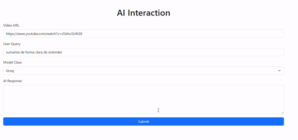

# transcricao_video_ia

Curso LLMs Projeto 01 - Transcrição e compreensão de vídeos

# Conversando com Vídeos do YouTube

Este projeto foi desenvolvido para facilitar a interação e compreensão de conteúdos de vídeos do YouTube sem a necessidade de assisti-los por completo.
## Objetivos do Projeto

- **Compreender o conteúdo de vídeos do YouTube sem assisti-los integralmente.**
- **Pesquisar informações úteis em vídeos de forma eficiente.**
- **Interagir com o conteúdo de vídeos através de uma interface de chat.(em desenvolvimento)**

## Tecnologias Utilizadas

Este projeto foi implementado com as seguintes tecnologias e ferramentas:

- **[LangChain](https://www.langchain.com/)**: Framework de construção de cadeias de chamadas e interações para IA.
  - **langchain_community**
  - **langchain-huggingface**
  - **langchain_ollama**
  - **langchain_openai**
  - **langchain_groq**
- **[Poetry](https://python-poetry.org/)**: Gerenciador de dependências e empacotamento para Python.
- **Django**

## Como Funciona

1. O usuário fornece o link de um vídeo do YouTube.
2. O vídeo é processado para transcrição e extração de informações relevantes.
3. O sistema utiliza técnicas de IA generativa para permitir que o usuário interaja com o conteúdo do vídeo em uma interface de chat.
4. Respostas e buscas são feitas no contexto do vídeo, garantindo precisão e relevância.

## Configuração do Ambiente

### Requisitos

- Python 3.12+
- Poetry instalado

### Passos de Configuração

1. Clone este repositório:
   ```bash
   git clone https://github.com/seu-usuario/seu-repositorio.git
   cd seu-repositorio
   ```

2. Configure as dependências com o Poetry:
   ```bash
   poetry install
   ```

3. Configure o arquivo `.env` com suas chaves de API necessárias:
   - Groq API Key
   - HuggingFace Token (se necessário)
   - Outros tokens relevantes

4. Execute a aplicação localmente com Streamlit:
   ```bash
   python manage.py runserver
   ```

# Demonstração do Projeto

